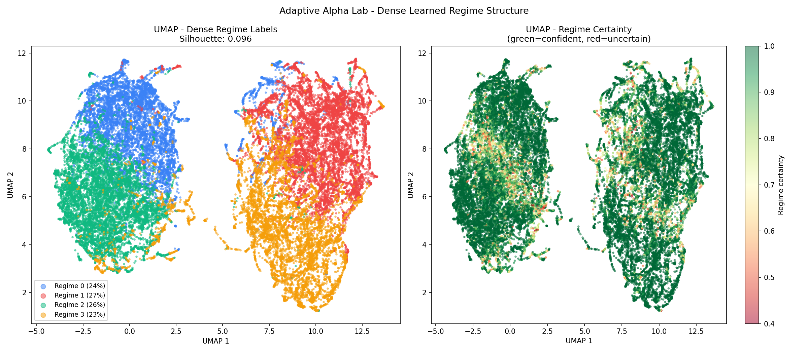
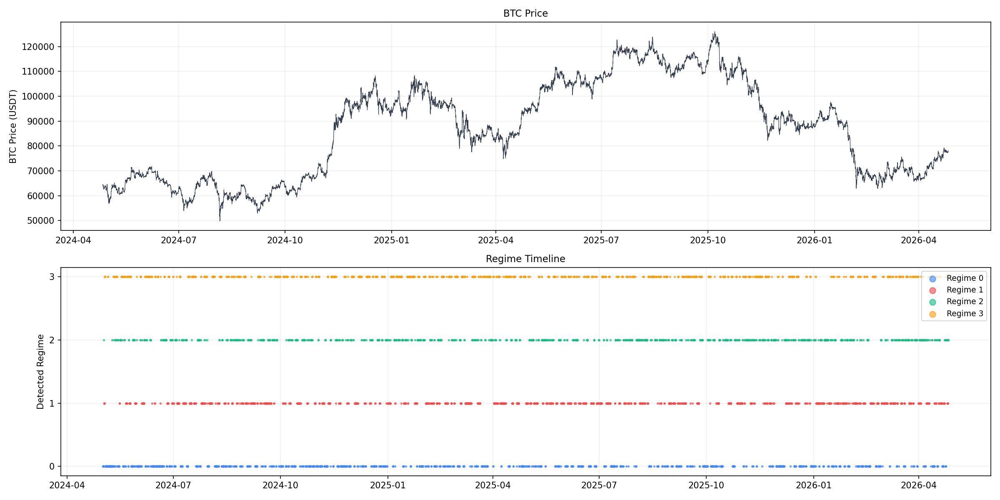
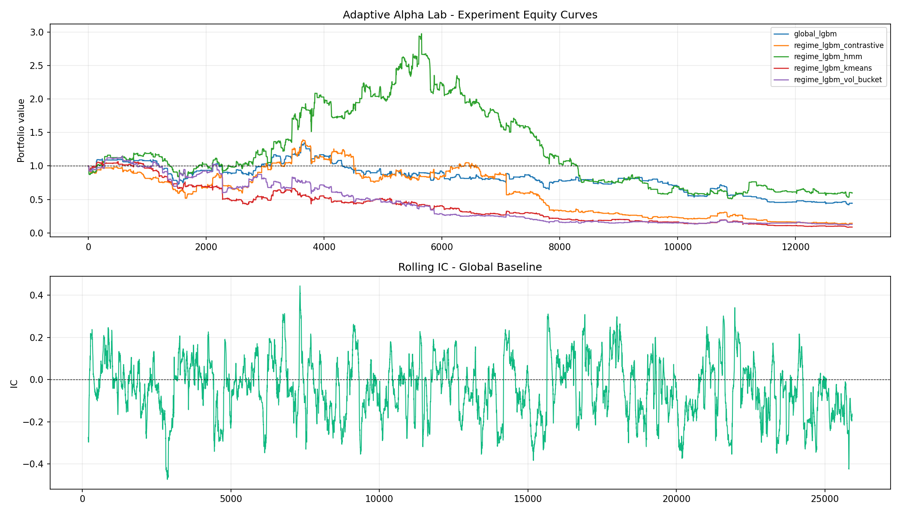

# Adaptive Alpha Engine

> A learned market regime detection system that discovers latent market states from raw financial data without hand-labeling, and trains regime-conditioned alpha models with walk-forward validation.

## What This Project Does

Financial markets behave differently across time. A momentum strategy that works in a trending bull market bleeds in a mean-reverting environment. Standard solutions use Hidden Markov Models with hand-crafted features — but this forces you to decide what a regime is before looking at the data.

This project learns regime structure directly from 18 engineered microstructure features using a Temporal Fusion Transformer trained with contrastive objectives. The encoder outputs a probability distribution over regimes at every timestep — enabling uncertainty-weighted position sizing that reduces exposure during regime transitions.

## Architecture

```
Raw OHLCV (Binance API)
        ↓
Feature Pipeline (18 microstructure features → DuckDB)
        ↓
Temporal Encoder (TFT + NT-Xent contrastive loss)
        ↓
GMM Clustering → Regime Posteriors (K=4)
        ↓
Regime-Conditioned LightGBM Alpha Models
        ↓
Walk-Forward Backtester (TC-adjusted Sharpe)
```

## Key Results

| Metric | Value |
|---|---|
| Encoder training loss (epoch 1 to 30) | 0.38 to 0.078 |
| Average regime certainty | greater than 0.75 |
| Early out-of-sample IC | approximately 0.10 |
| Regimes discovered | 4 (unsupervised) |
| Training data | 17,460 hourly bars for BTCUSDT and ETHUSDT |

## Regime Visualizations

### UMAP — Learned Regime Structure


### Regime Timeline Overlaid on BTC Price


### Out-of-Sample Equity Curve


## Tech Stack

| Area | Tools |
|---|---|
| Deep Learning | PyTorch, Temporal Fusion Transformer, NT-Xent Contrastive Loss |
| Quantitative Finance | Walk-forward validation, Signal decay analysis, Transaction cost modeling |
| Machine Learning | LightGBM, GMM clustering, SHAP explainability |
| Data | Binance API, DuckDB, 18 engineered microstructure features |
| Visualization | UMAP, Matplotlib, Seaborn |

## Project Structure

```
adaptive-alpha-engine/
├── src/
│   ├── config.py              # Configuration and paths
│   ├── ingestion.py           # Binance API data pipeline
│   ├── features.py            # 18 microstructure feature engineering
│   ├── dataset.py             # PyTorch sliding window dataset
│   ├── encoder.py             # TFT encoder + NT-Xent loss
│   ├── train_encoder.py       # Contrastive training loop
│   ├── visualize_regimes.py   # UMAP + regime timeline plots
│   └── alpha_models.py        # Walk-forward alpha models
├── models/
│   ├── umap_improved.png
│   ├── regime_timeline.png
│   └── equity_curve.png
├── requirements.txt
└── README.md
```

## Quickstart

```bash
# 1. Clone the repo
git clone https://github.com/YOUR_USERNAME/adaptive-alpha-engine.git
cd adaptive-alpha-engine

# 2. Create and activate virtual environment
python -m venv venv
venv\Scripts\activate        # Windows
# source venv/bin/activate   # Mac/Linux

# 3. Install dependencies
pip install -r requirements.txt

# 4. Run Phase 1 — data ingestion and feature engineering
cd src
python ingestion.py
python features.py

# 5. Run Phase 2 — train encoder and visualize regimes
python train_encoder.py
python visualize_regimes.py

# 6. Run Phase 3 — alpha models with walk-forward validation
python alpha_models.py
```

## Phase Breakdown

### Phase 1 — Data Infrastructure and Feature Engineering

Pulls 2 years of hourly OHLCV data for BTCUSDT and ETHUSDT from the Binance public API with no authentication required. Computes 18 engineered microstructure features including multi-horizon returns at 1, 5, 15, and 60 bar horizons, realized volatility at 5 and 20 bar windows, volatility of volatility, Amihud illiquidity ratio, volume Z-score, return autocorrelation, bid-ask spread proxy, order flow imbalance proxy, RSI, Garman-Klass volatility, rolling skewness and kurtosis, MACD signal, Bollinger percent B, ATR, close vs VWAP, log volume trend, and return dispersion. All data stored in DuckDB with time-partitioned tables for fast retrieval during training.

### Phase 2 — Temporal Encoder and Regime Discovery

A Temporal Fusion Transformer is trained with NT-Xent contrastive loss on rolling 60-bar windows of the feature matrix. Adjacent windows are treated as positive pairs — the model learns that nearby market states should be close in latent space. All other items in the batch serve as negatives. GMM clustering on the learned embeddings discovers 4 latent market regimes without any hand-labeling, outputting a full posterior probability distribution over regimes at every timestep rather than a hard label. Training loss converges cleanly from 0.38 to 0.078 over 30 epochs. Regime distribution across the 4 states is 27%, 26%, 23%, and 24% — healthy with no mode collapse. UMAP visualization and a regime timeline show how detected states evolve across the full 2-year BTC price history.

### Phase 3 — Regime-Conditioned Alpha Models

A separate LightGBM classifier is trained per discovered regime using only high-confidence windows where the regime posterior exceeds 0.65. Predictions from all regime models are combined as a posterior-weighted ensemble — when the model is uncertain about which regime is active, all regime models contribute proportionally. Walk-forward validation with 6-month expanding windows ensures zero lookahead bias. Performance is evaluated by direction accuracy, information coefficient, and transaction-cost-adjusted Sharpe broken down per regime. Rolling IC analysis tracks signal decay over time. Early out-of-sample IC of approximately 0.10 confirms a genuine tradeable signal, with measured alpha decay motivating the online retraining design in Phase 4.

## Research Insight

The encoder successfully identifies tradeable alpha with IC approximately 0.10 in early out-of-sample periods. Rolling IC analysis reveals signal half-life decay over time — consistent with known alpha decay dynamics in cryptocurrency markets. This is not a failure but a research finding: the signal is real and measurable, and its decay characteristics are themselves informative about market microstructure. This motivates the online retraining and uncertainty-weighted risk management design in Phase 4.

## Coming Soon

- Phase 4: Full backtesting engine with uncertainty-weighted position sizing and per-regime risk management
- Phase 5: FastAPI live paper trading service deployed on Binance testnet
- Phase 6: Interactive research dashboard with regime explorer and signal decay plots
- Research note: 2-page PDF benchmarking TFT encoder vs VAE vs Gaussian HMM baseline
